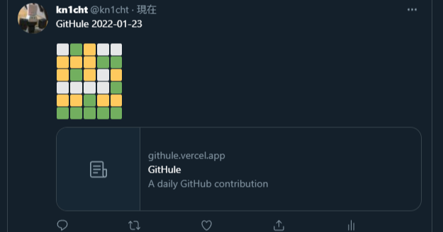

# GitHule [](https://github.com/sallar/github-contributions-canvas/blob/master/LICENSE)

GitHule generates Wordle-like contribution graphs based on your GitHub contributions.



Original source code: [sallar/github-contributions-chart](https://github.com/sallar/github-contributions-chart)

## Install

Install the packages using [NPM](https://nodejs.org/en/):
```
$ npm install
```

## How to run

Running locally:
```
$ npm run dev
```

## Deployment

This project is deployed on [Vercel](https://vercel.com/).

## Contributing

Please read [CONTRIBUTING.md](./CONTRIBUTING.md) for details on our code of conduct, and the process for submitting pull requests to us.

## License

[MIT license](https://opensource.org/licenses/MIT)
